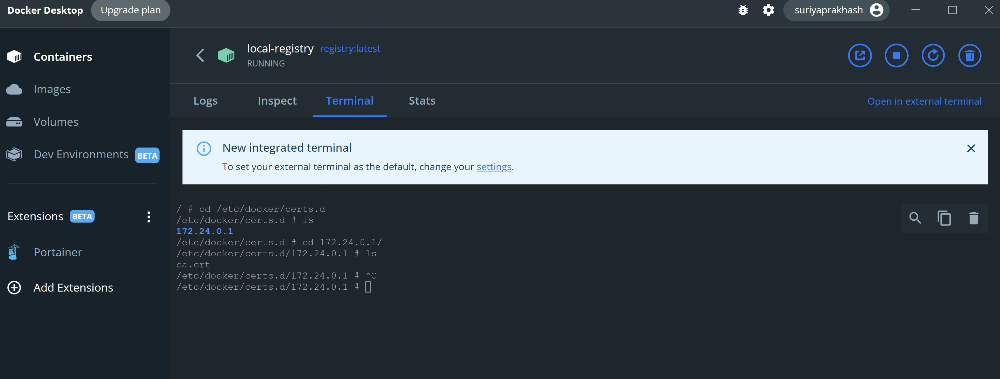
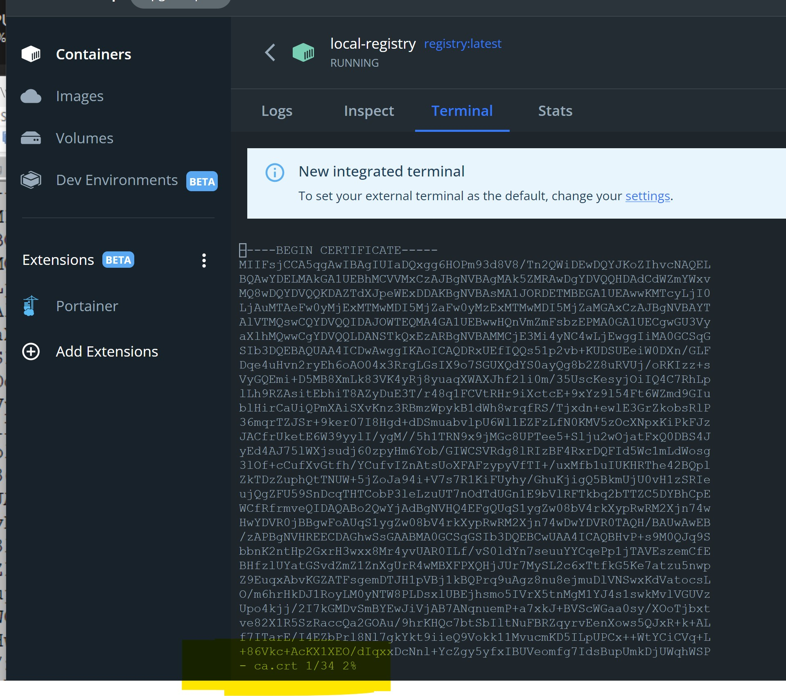
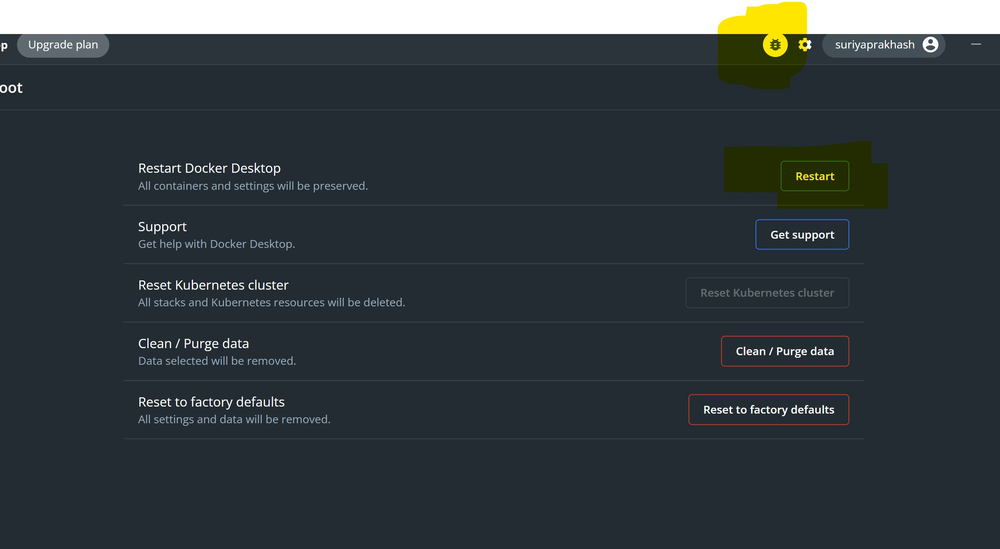

# Docker registry

## Exercise

```
docker pull registry
```

**Volume** is the folder as *docker-registry\volume*

```cmd
docker run -d --name local-registry -p 5000:5000 -v C:\\Suriya\\ws\\learning\\cloud\\docker-registry\\volume:/var/lib/registry registry:latest
```
Make sure you run from the right directory of the volume
```bash
docker run -d --name local-registry -p 5000:5000 -v $(pwd)/volume:/var/lib/registry registry:latest
```

### Https

A self signed cert creation, the following will spit out self signed **public key cert** and a **private key**. Need CA for intermidate cert if required.

```
openssl req -x509 -newkey rsa:4096 -keyout certs/key.pem  -days 365  -out certs/cert.pem -addext 'subjectAltName = IP.1:172.24.0.1' -sha256 -days 365
```

spit out unencrypted key so that registry can parse
```
openssl rsa -in certs/key.pem -out certs/key.unencrypted.pem -passin pass:suriya
```

Start the container,
```
docker run --name local-registry \
    -d --restart=always \
    -v C:\\Suriya\\ws\\learning\\cloud\\docker-registry\\volume:/var/lib/registry \
    -v C:\\Suriya\\ws\\learning\\cloud\\docker-registry\\certs:/certs \
    -e REGISTRY_HTTP_ADDR=0.0.0.0:443 \
    -e REGISTRY_HTTP_TLS_CERTIFICATE=certs/cert.pem \
    -e REGISTRY_HTTP_TLS_KEY=certs/key.unencrypted.pem \
    -p 5443:443 \
    registry:latest
```

Get into the container, and copy the **cert.pem** that we generated into */etc/docker/certs.d/{IPV4}/ca.crt*
```
cd /etc/docker
mkdir certs.d
cd certs.d
mkdir 172.24.0.1
cd 172.24.0.1
vi ca.crt
```





Restart the docker hub



#### Alternate ways to generete cert

This generates key
```
openssl req -newkey rsa:4096 -nodes -keyout key.pem -x509 -days 365 -out cert.pem -addext 'subjectAltName = IP:172.24.0.1' -subj '/C=US/ST=NY/L=Buffalo/O=Suriya/OU=RND/CN=Suriya/'
```

This is another sample

```
export HOST="my.host"
export IP="127.0.0.1"
openssl req -newkey rsa:4096 -nodes -keyout ${HOST}.key -x509 -days 365 -out ${HOST}.crt -addext 'subjectAltName = IP:${IP}' -subj '/C=US/ST=CA/L=SanFrancisco/O=MyCompany/OU=RND/CN=${HOST}/'
```

With CA

This genertes the private key (with pass phrase)
```
openssl genrsa -aes256 -out CAKey.pem 4096
```
Enter CA_PASSPHRASE

```
openssl req -new -x509 -sha256 -days 1000 -key CAKey.pem -out CA.pem
```

```
openssl genrsa -out DomainKey.pem 4096
```

```
openssl req -new -x509 -sha256 -days 1000 -addext 'subjectAltName = IP:172.24.0.1' -key DomainKey.pem -out DomainCert.pem
```


#### To set this as insecure-registry
Setting insecure in config in C:\Users\suriy\.docker\daemon.json alternatively in Docker desktop -> Settings -> Docker engine
```json
  "insecure-registries": [
    "172.24.0.1:5000"
  ]
```

REGISTRY_HTTP_ADDR – The default port of HTTPS is 443 and to expose the port, it is required to listen on all interfaces.
REGISTRY_HTTP_TLS_CERTIFICATE – Path of the .crt file in the context of the container. This will be from the bind mount /opt/certs/server.crt file.
REGISTRY_HTTP_TLS_KEY – Path of the .key file from /opt/certs/server.key.
REGISTRY_AUTH – This will be the type of authentication you want to set up. In this case, it should be set to htpasswd.
REGISTRY_HTTP_HTPASSWD_REALM – In the basic authentication REALM is nothing, but a protection space which could be any arbitrary string for the authenticator to understand the type of authentication. For more information read this answer on the StackOverflow community.
REGISTRY_HTTP_HTPASSWD_PATH – Provide the file that contains all the usernames and passwords in the /opt/auth/htpasswd file.   

### Https during curl

Browser -> Settings -> Search for Certs -> Trustued certs -> Import the generated **certs.pem**.

## Reference

- Docker registry distribution [gitlab](https://github.com/distribution/distribution)
- [Docker hub registry](https://hub.docker.com/_/registry)