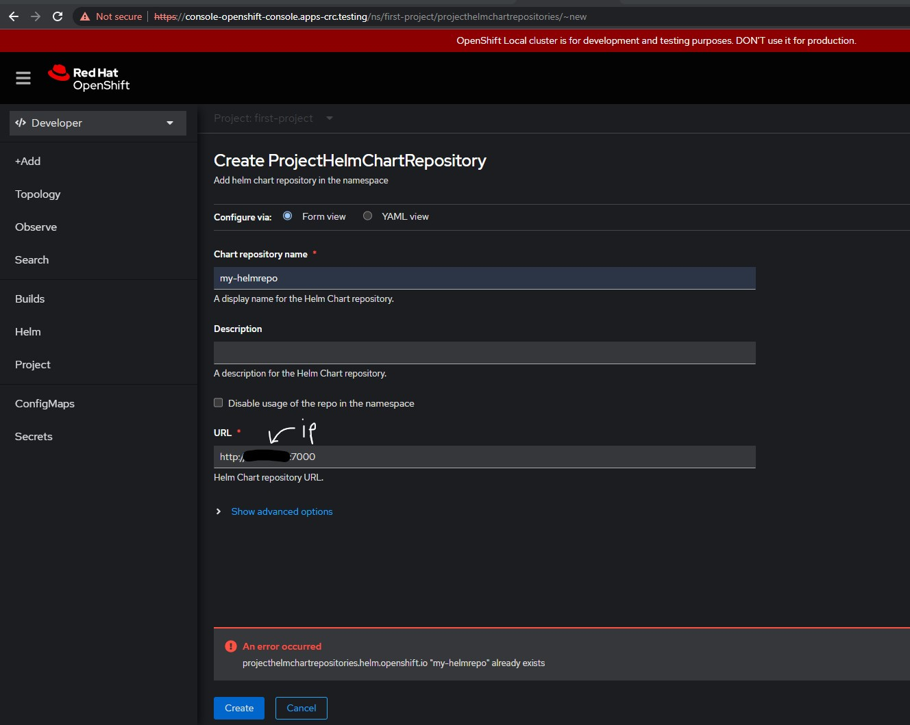
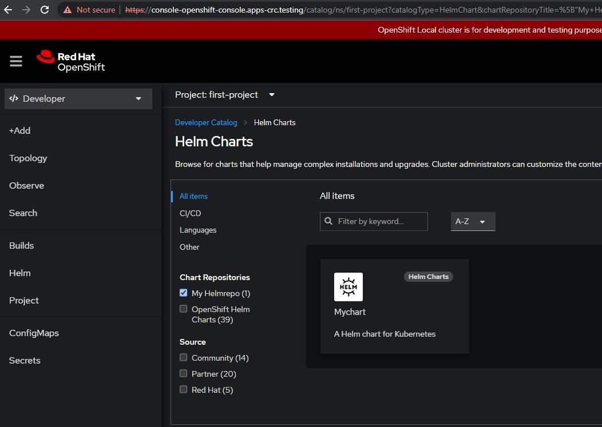
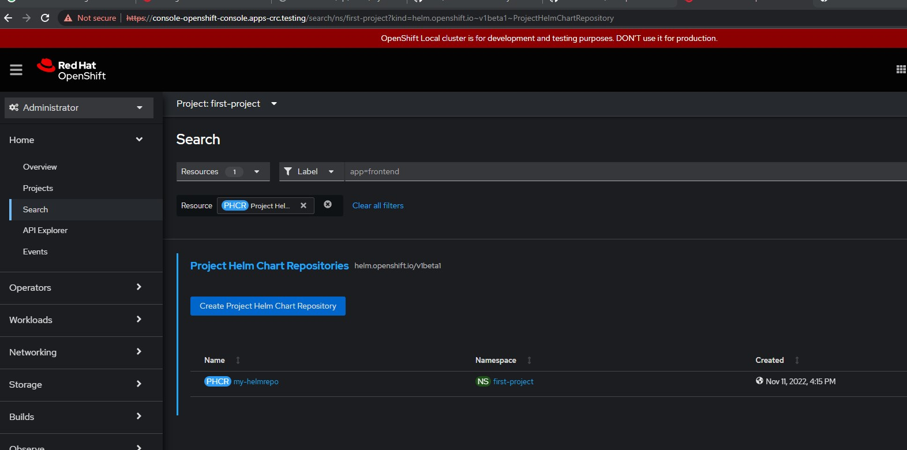

# HELM


## Running helm registry

### Runnin helm with Bitnami chartmuseum

```
docker pull bitnami/chartmuseum:latest
```

```
docker run --name local-helm-registry \
    --rm -it -d \
    -p 7000:8080 \
    -v C:\\Suriya\\ws\\learning\\cloud\\helm\\volume:/bitnami/data \
    bitnami/chartmuseum:latest
```

Goto [Running chart in OC](#running-chart-in-oc)

### Runnin helm with Chartmuseum (Permission denied to push chart to windows dir)

https://github.com/helm/chartmuseum

```
docker pull chartmuseum/chartmuseum:latest
```
In windows gitbash, is throwing **permission denied** as it is trying to store in C:\\Suriya\\ws\\learning\\cloud\\helm\\data

```bash 
docker run --name local-helm-registry \
  --rm -it -d \
  -p 7000:8080 \
  -v C:\\Suriya\\ws\\learning\\cloud\\helm\\volume\\charts:/charts \
  -v C:\\Suriya\\ws\\learning\\cloud\\helm\\volume\\data:/data \
  -e DEBUG=true \
  -e STORAGE=local \
  -e STORAGE_LOCAL_ROOTDIR=C:\\Suriya\\ws\\learning\\cloud\\helm\\volume\\data \
  chartmuseum/chartmuseum
```

In bash,

```
docker run --name local-helm-registry \
  --rm -it -d \
  -p 7000:8080 \
  -v $(pwd)/charts:/charts \
  -e DEBUG=true \
  -e STORAGE=local \
  -e STORAGE_LOCAL_ROOTDIR=/charts \
  chartmuseum/chartmuseum
```

curl http://localhost:7000/

#### Chartmuseum for debugging

##### Downloading

https://github.com/helm/chartmuseum#installation

```
curl https://raw.githubusercontent.com/helm/chartmuseum/main/scripts/get-chartmuseum | bash
```

##### Debugging

```
chartmuseum --debug --port=7000 \
  --storage="local" \
  --storage-local-rootdir="C:\\Suriya\\ws\\learning\\cloud\\helm\\chartstorage"
```


## Running chart in OC

### Adding my chart to local Helm repo

```
helm create mychart
```

Navigate to **mychart** folder and update yaml, the following would produce a tgz

```
helm package .
```

Use postman or the following to upload the *mychart* tgz to the **local chart museum**

```bash
curl --data-binary "@mychart-0.1.0.tgz" http://localhost:7000/api/charts
```

The following GET call display the charts,
```bash
curl http://localhost:7000/api/charts
```
returns 
```json
{"mychart":[{"name":"mychart","version":"0.1.0","description":"A Helm chart for Kubernetes","apiVersion":"v2","appVersion":"1.16.0","type":"application","urls":["charts/mychart-0.1.0.tgz"],"created":"2022-11-12T00:35:30.745673797Z","digest":"3e9df09e9ab66cf2430d2c559bcc839e105634055f68b5aec5e954dcfa9105c9"}]}
```


#### Helm cm-push plugin

Alternatively, we can push by installing https://github.com/chartmuseum/helm-push#helm-cm-push-plugin

```
helm cm-push mychart/ http://localhost:7000
```


### OC

https://docs.openshift.com/container-platform/4.7/cli_reference/helm_cli/getting-started-with-helm-on-openshift-container-platform.html
https://v2.helm.sh/docs/chart_template_guide/

Creating **my-helmrepo** object in OC pointing to the *localhost:7000*



Check for the upated catalog


Check creation by **searching** as **admin**


Image pull CA -cert
https://docs.openshift.com/container-platform/4.7/cicd/builds/setting-up-trusted-ca.html
https://myopenshiftblog.com/custom-image-pull-requirements/

### Adding a repo

Adds a repo in localhost:7000 (Not required in case of openshift) TODO: explore with kube, understand what it does

```
helm repo add myrepo http://localhost:7000
```

The following should show a chart after [adding the chart to the local helm registry](#adding-my-chart-to-local-helm-repo)
```
helm search repo myrepo/
```

The followin should show 

```
helm repo list
```

```
helm repo remove myrepo
```