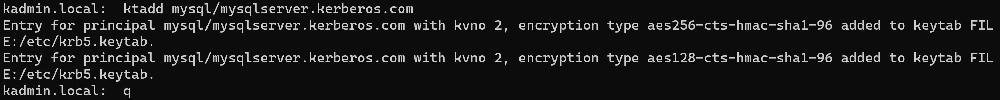
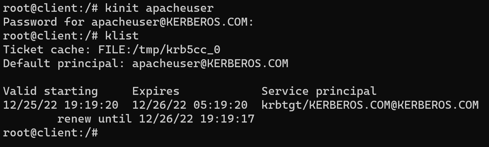

# Kerberos

## Contents

- [KDC](#krb5-kdc) 
- [Client](#krb5-client)
- [Server](#krb5-server)
- [Testing with KDC server](#testing-client-with-kdc-server)
- [Testing client with mysqlserver using KDC](#testing-client-with-mysqlserver-using-kdc)
- [Reference](#reference)

## Krb5 KDC

```
docker run --name kdc-server --hostname kdc.kerberos.com -it ubuntu
```

```
apt-get update
```

Set time zone **when timezone is required and is *not mandatory*** ,
```
apt-get install -yq tzdata
```

Skip if you run the above step. Set time zone using docker
```
RUN apt-get update && \
    apt-get install -yq tzdata && \
    ln -fs /usr/share/zoneinfo/America/New_York /etc/localtime && \
    dpkg-reconfigure -f noninteractive tzdata
```

Getting IP address of the docker image
```
docker inspect kdc-server
```

Installing vim
```
apt-get install vim
```

### KDC and KAdmin Server

Install krb5-kdc and krb5-admin-server
```
apt install krb5-kdc krb5-admin-server
```

If prompted,
```
Default Kerberos version 5 realm: KERBEROS.COM
Kerberos servers for your realm: kdc.kerberos.com
Administrative server for your Kerberos realm: kdc.kerberos.com
```

Update the */etc/krb5.conf* with the realm info,
```
docker cp .\krb5.conf kdc-server:/etc/krb5.conf
```

Check the status of the service,
```
service --status-all
```

The following would promt for **KDC database master key**
```
krb5_newrealm
```
when prompted for kdc master key
```
kdc
```

In case of error in realm config change the **krb5.conf** file and run to reconfigure
```
dpkg-reconfigure krb5-kdc
```

### kadmin.local

#### Add principal

To add a user principal
```
kadmin.local
```
To Add Principal
```
addprinc usera/admin
```
when prompted for password enter pricipal password

#### Display all principal

Display all principals
```
list_principals 
```

#### Quit 

```
quit
```

### ACL

The file */etc/krb5kdc/kadm5.acl* is used by the **kadmin** to [manage access rights to the database](https://web.mit.edu/kerberos/krb5-1.12/doc/admin/conf_files/kadm5_acl.html).


### Adding SPN for services

```
kadmin.local
```

Add the principal using *random key* in the format *service/host@REALM* format,

```
addprinc -randkey mysql/mysqlserver.kerberos.com
```

```
ktadd mysql/mysqlserver.kerberos.com
```



```
klist -k /etc/krb5.keytab
```


## Krb5 Client

```
docker run --name kerberos-client --hostname client.kerberos.com -it ubuntu
```

```
apt-get update
```

### Client Installation

Install following packages,

```
apt-get install krb5-user
```

Check for [kdc realm config](#kdc-and-kadmin-server) for **realm**, **kerberos server** and **admin server** information.

The following is not required,
```
apt-get libpam-krb5 libpam-ccreds auth-client-config
``` 

Get the docker ip to be added to the host file in the next step
```
docker inspect <container-name>
```

### Host update

Install **vim** to update the **hosts** file
```
apt-get install vim
```

Update host file */etc/hosts* to point to the **kdc ip**

Follow the steps in [Testing client with KDC server](#testing-client-with-kdc-server) for testing the TGT

### Installing mysql as client


Install the following to get the client, and do not run the mysql server here. It will run as [Krb5 Server](#krb5-server).
```
apt-get install mysql-client
```


## Krb5 Server

```
docker run --name mysql-server --hostname mysqlserver.kerberos.com -it ubuntu
```

```
apt-get update
```

### Install mysql server

```
apt-get install mysql-server
```

```
service --status-all
```

```
service mysql start
```
### Changes for username password remote login

#### User changes in mysql

Open mysql CLI
```
mysql -u root
```
By default it will let you in, just in case if prompted, default password is ***password***

```
show databases;
```

Run the following to force **the *root* password** every time,
```
USE mysql;
UPDATE user set authentication_string=NULL where User='root';
FLUSH privileges;
ALTER USER 'root'@'localhost' IDENTIFIED WITH caching_sha2_password BY 'p@ssw0rd';
FLUSH privileges;
QUIT
```

#### Expose the mysql to the client


The following will create a user to be accessed from the outside world instead of using **root user**

```
CREATE USER 'usera'@'%' IDENTIFIED BY 'password';
GRANT ALL PRIVILEGES ON *.* TO 'usera'@'%' WITH GRANT OPTION;
FLUSH PRIVILEGES;
```

the above will create a user with the name 'usera'. Form the other machines use
```
mysql -u usera -p
```
when promted use **password**

### Changes for Kerberos in mysql server

We need the following,
- KAdmin tool to connect to KDC to create SPN
- Use KAdmin tool to Generate service keys as **keytab** file
- Configure the plugin, SPN and keytab file location in my.cnf

#### When you have permission to add princ from mysql-server machine

```
apt-get install krb5-user
```
the above is similar to [client](#krb5-client) as we will be only using the Kadmin tool.

Check for [kdc realm config](#kdc-and-kadmin-server) for **realm**, **kerberos server** and **admin server** information.

Update the *host file* **/etc/hosts** with kdc ip entry

```
kadmin -p usera/admin
```

Add the principal using *random key* in the format *service/host@REALM* format,

```
addprinc -randkey mysql/mysqlserver.kerberos.com
```

#### When you do not have permission to add princ from mysql-server machine

[if the above thing is not possible add it in the KDC server](#adding-spn-for-services)

Now copy the **krb5.keytab** file over to this server from **kdc server**,

```
docker cp kdc-server:/etc/krb5.keytab .
```
```
docker cp .\krb5.keytab mysql-server:/etc/krb5.keytab
```

Now in the mysql server,
```
klist -k /etc/krb5.keytab
```


#### MySql Configuration changes

The first two points are done, now we need to [configure the mysql](https://dev.mysql.com/doc/mysql-security-excerpt/8.0/en/kerberos-pluggable-authentication.html)

Update the following in **/etc/mysql/conf.d/mysql.cnf** here we are updating the first one in the order if you have different *my.cnf* check the configuration order in following location

```
Default options are read from the following files in the given order:
/etc/mysql/my.cnf
/etc/mysql/conf.d/mysql.cnf
/etc/mysql/mysql.conf.d/mysql.cnf
```


Follow [Testing client with mysqlserver using KDC](#testing-client-with-mysqlserver-using-kdc) to test connection

If the **autentication_kerberos.so** is not found in */usr/lib/mysql/plugin* directory, then [download it from the mysql plugins repo](#download-mysql-plugins)

#### Download mysql plugins

[Steps in here]( https://ubuntu.pkgs.org/22.04/mysql-8.0-amd64/mysql-community-client-plugins_8.0.31-1ubuntu22.04_amd64.deb.html)

```
apt-get install wget
```
to download

to check mysql version
```
mysql -V
```

```
 wget https://repo.mysql.com/mysql-apt-config_0.3.8-1ubuntu14.04_all.deb
```

```
dpkg -i mysql-apt-config_0.3.8-1ubuntu14.04_all.deb
```


```
Download latest mysql-apt-config deb from
https://repo.mysql.com/
Install mysql-apt-config deb:
# sudo dpkg -i mysql-apt-config_*.deb
Update the package index:
# sudo apt-get update
Install mysql-community-client-plugins deb package:
# sudo apt-get install mysql-community-client-plugins
```


## Testing Client with KDC Server

### Validation as a client

To get the keytab,

```
kinit usera/admin
```
here the [**usera/admin** is the principal](#add-principal) added earlier to the database


To display the keytab,
```
klist
```

### Validating on the KDC
```
kadmin.local: getprinc kuser
```


```
klist
```


### Validating client to connect to mysql server using kdc


### KTUtil

```
ktutil
```

```
read_kt /etc/krb5/krb5.keytab
```

```
list
```

## Testing client with mysqlserver using KDC

### Adding a separete kerberos user for testing

In the KDC server **userk**,
```
addprinc userk
```


In the mysql server add the **userk** and allow login using kerberos for the **userk**,


## Reference

- https://ubuntu.com/server/docs/service-kerberos
- https://dev.mysql.com/doc/mysql-security-excerpt/8.0/en/kerberos-pluggable-authentication.html


## Testing client with ngnix


```
docker run --name nginx-server --hostname nginxserver.kerberos.com -it ubuntu
```

```
apt update
```

```
apt install nginx
```

```
apt install vim
```

```
apt install curl
```

```
apt install git
```

```
cd /opt
git clone https://github.com/stnoonan/spnego-http-auth-nginx-module
```

```
apt install wget
```
Check from [nginx](http://nginx.org/en/download.html) or from [download](https://nginx.org/download/) for the version
```
wget https://nginx.org/download/nginx-1.23.3.tar.gz
```

```
tar -xvzf nginx-1.23.3.tar.gz
```

```
cd nginx-1.23.3

```

## Testing client with Apache


```
docker run --name apache-server --hostname apacheserver.kerberos.com -it ubuntu
```

```
apt update
```

```
apt install curl
```

```
apt install vim
```

```
apt install apache2
```

Copy [index.html](apache/index.html) into */var/www/html*
```
docker cp .\apache\index.html apache-server:/var/www/html
```

```
service --status-all
```

```
service apache2 start
```

```
curl localhost:80
```

### Steps
Following this [post](https://active-directory-wp.com/docs/Networking/Single_Sign_On/Kerberos_SSO_with_Apache_on_Linux.html)

- Update the **client** */etc/hosts* config and add apacheserver ip,

```
172.17.0.5      apacheserver.kerberos.com apacheserver
```

- Install **curl** in client and try
```
curl apacheserver.kerberos.com
```


- In the **apacheserver**,
```
apt-get install libapache2-mod-auth-kerb
```
Check for [kdc realm config](#kdc-and-kadmin-server) for **realm**, **kerberos server** and **admin server** information.

- Update */etc/apache2/sites-available/000-default.conf*  to copy [000-default.conf](apache/000-default.conf) from local into the container
```
docker cp .\apache\000-default.conf apache-server:/etc/apache2/sites-available/000-default.conf
```

```
service apache2 restart
```

- After restart, in the **client** try
```
curl apacheserver.kerberos.com
```


Now we need to create 
- a user principal *apacheuser*
- a service principal *HTTP/apacheserver.kerberos.com*

Let use **KDC server**,

```
kadmin.local
```

```
addprinc apacheuser
```
here since its service we are doing it as -randkey for random key
```
addprinc -randkey HTTP/apacheserver.kerberos.com
```
```
list_principals
```


Now we need to create a **keytab file** for apacheserver **in kdc server** and copy it to **apacheserver**

```
ktadd HTTP/apacheserver.kerberos.com
```

```
klist purge
```
Copy the keytab from **kdcServer** to **apacheServer** via **host machine**

```
docker cp kdc-server:/etc/krb5.keytab .\apache\kerberos.keytab
```

```
docker cp .\apache\kerberos.keytab apache-server:\etc\kerberos.keytab
```


Restart the apache2 server
```
service apache2 restart
```

Now the final step,

```
kinit apacheuser
```



Now we need to set the *keytab* to environment
```
export KRB5CCNAME=/tmp/krb5cc_0
```

Now try the following,
```
curl --negotiate -u : apacheserver.kerberos.com
```


To test it again try,

```
kdestroy -A
```

