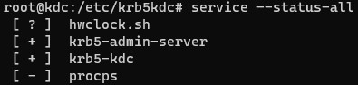
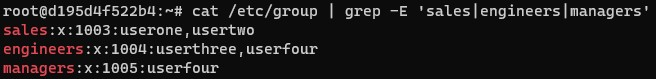

# Linux Basic Commands

## Content

- [Setting up in local](#setting-up-in-local)
- [Group](#group)
- [User](#user)
- [Group User Relation](#group-user-relation)
- [Service][service]
- [Grep](#grep)

## Setting up in local

### Create ubuntu machines

Create temp ubunutu machines for testing.

```
docker run --name ubuntu-machine -it ubuntu /bin/bash 
```

### Exec

```
docker exec -it ubuntu-machine sh
```

### Advanced Package Tool (APT) library

A package management system for linux distribution

```
apt-get update
```

### Installing sudo 

```
apt-get install sudo
```

### Change User password

```
passwd
```

## Group

### List group

```
cat /etc/group
```

### Add group
```
groupadd sales
```

### Update group
```
groupmod -n engineering eng
```

### Delete group

```
groupdel managers
```


## User

### Switch user

```
su root
```

### List users

```
cat /etc/passwd
```

### Add user

```
adduser userone
```

### Update user

```
usermod -l user3 userthree
```
 
### Delete user

```
userdel user3
```

More on [userdel vs deluser](https://www.bswen.com/2021/06/others-what-diff-between-userdel-and-deluser.html) to know the difference.

**Note** *userthree* group would exists in the group. Use [delete group](#delete-group) to delete the *userthree* group.

## Group User relation

### List user groups

```
cat /etc/group | grep sales
```

### Add/Update user to a group

For existing users
```
usermod -G sales userone
```

Multiple groups
```
usermod -G sales,managers userfour
```

### Delete user from a group

```
deluser userfour sales
```

More on [userdel vs deluser](https://www.bswen.com/2021/06/others-what-diff-between-userdel-and-deluser.html) to know the difference.

## Service

### List

```
service --status-all
```


here
- [+] represents running
- [-] stopped service

### Start

```
service <service-name> start
```

### Stop

```
service <service-name> stop
```

### Restart

```
service <service-name> restart
```


## Grep

For multiple **Extended regex(E)** with **ignore case(i)**

```
cat /etc/group | grep -iE 'sales|engineeRs|Managers'
```



