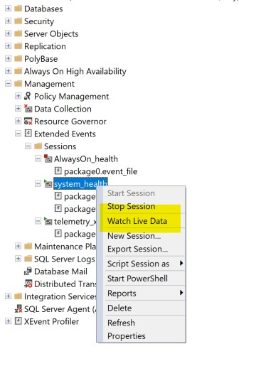

# Deadlock analysis

## Base

### Create

```
CREATE TABLE Persons (
    ID int NOT NULL PRIMARY KEY,
    LastName varchar(255) NOT NULL,
    FirstName varchar(255),
    Age int
);
```

### Select
```
/** select **/
select * from Persons;
```

### Insert
```
/** insert **/
insert into Persons (ID, LastName, FirstName, Age) values (1, 'Suriya', 'Prakhash', 31);
insert into Persons (ID, LastName, FirstName, Age) values (2, 'Renu', 'Prakhash', 26);
```

### Delete
```
/** delete **/
delete from Persons;
```

### Check for uncommited transcations

```
/** Check if any uncommited transactions **/
SELECT 
er.session_id
,er.open_transaction_count
FROM sys.dm_exec_requests er
```

## Types

### Monitoring

Mangement -> System_health, right click Watch live data



### Replication method

#### Same table - different row order change

Execute the following line by line, one line from session 1 and other from session 2 then session 1 and so on..

Session 1 - in a new tab
```
/** Transcation Session 1 **/
BEGIN TRAN one;
update Persons set FirstName='one id1 first transcation' where ID = 1;
update Persons set FirstName='one id2 first transcation' where ID = 2;
ROLLBACK TRAN one;
COMMIT TRAN one;
```

Session 2 - in a new tab
```
/** Transcation Session 2 **/
BEGIN TRAN two;
update Persons set FirstName='one id2 second transcation' where ID = 2;
update Persons set FirstName='one id1 second transcation' where ID = 1;
ROLLBACK TRAN two;
COMMIT TRAN two;
```

This results in a [deadlock](./deadlock-xml/same%20table%20-%20different%20row%20order%20change.xml) owner mode x and waiter mode x
