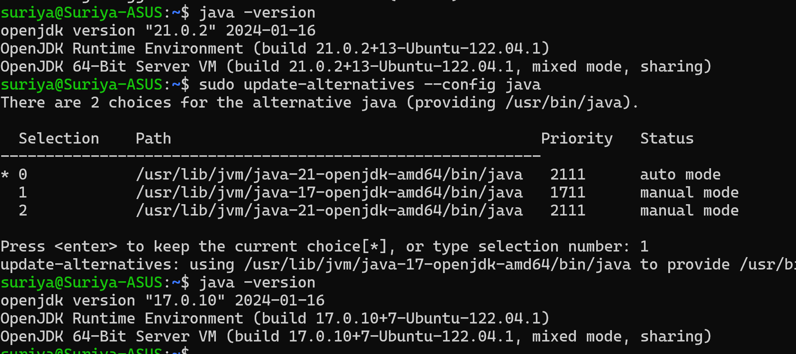

# wsl-java

- [Basic](#basic)
- [Search for Open JDK](#search-for-open-jdk)
- [Install JDK](#install-jdk)
- [Switch versions](#switch-versions)
- [Uninstall JDK](#uninstall-jdk)
- [Load test installation](#load-test-installation)

## Basic

- Switch user

```
sudo su <username>
```

- apt update - since you started with the vanilla import wsl

```
sudo apt update
```

## Search for Open JDK

```
apt search openjdk-21
```

Go with **headless** for servers and **jdk** for the ones with graphics and stuff _e.g JavaFX_


## Install jdk

```
sudo apt install openjdk-21-jdk openjdk-21-source openjdk-21-doc -y
```
Here,
- **-y** is for *Yes* for the prompts.
- Install *source* and *doc* only for the development

```
java -version
```

Check where Java is installed,
```
/usr/bin/java
```
The above is where the link if referenced, however it would be installed in the **usr/lib/jvm** folder

```
ls /usr/lib -la | grep jvm
```
(or)
```
ls /usr/lib/jvm -la
```

## Switch versions

- List all and switch alternatives installed,

```
sudo update-alternatives --config java
```



- Check the version now,

```
java -version
```

## Uninstall JDK

```
sudo apt remove openjdk-11-* -y
```

The above removes openjdk 11 and its corresponding files and association


```
sudo apt autoremove -y && sudo apt clean -y
```

The above removes any unused linked dependency

## Load test installation

### Install k6

```
sudo apt install k6
```
gets installed under ```/usr/bin/k6``` folder

### Install ab

```
sudo apt install apache2-utils
```
gets installed under ```/usr/bin/ab``` folder
